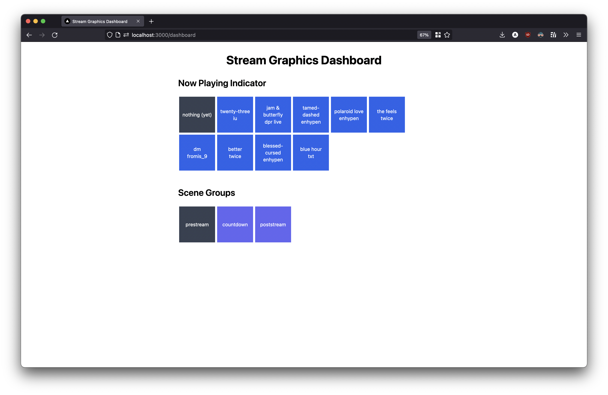
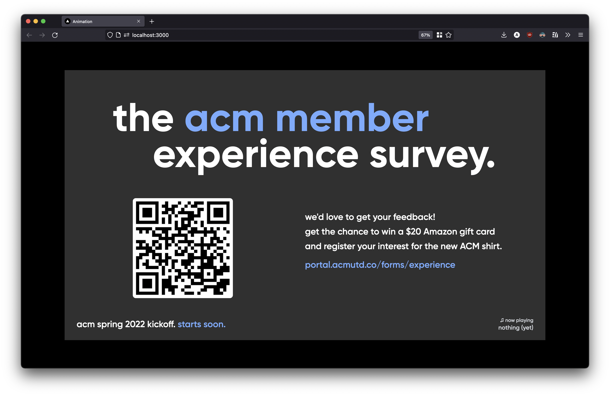

# ACM Stream Graphics

This powered the graphics at [ACM UTD](//acmutd.co)'s Spring 2022 kickoff [live stream](//www.youtube.com/watch?v=5iIJlpq97OI). This is very much unclean spaghetti code, so please don't use this as an example for anything.

## Technologies
- Next.js
- React
- Framer Motion
- SWR

## Screenshots

Stream dashboard with scene groups and now-playing indicator toggles

&nbsp;

Stream graphics view on viewport sized larger than 1080p.

&nbsp;

## What is a scene group?
A **scene group** is a set of scenes played in sequence on repeat. Scene groups can be used to display different sets of graphics at different points in the stream.

## License and Copyright
None yet. Not available for reuse.

The ACM UTD and Amazon Gift Card logos are property of their respective owners.